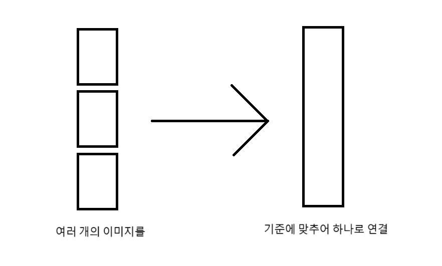

# 이미지 연결



이미지 병합은 한 회차의 이미지들을 적당한 개수로 묶어 하나의 이미지로 연결하는 기능입니다.

이미지 병합 시에 하나로 묶을 이미지의 개수를 결정하는 데에는 다양한 방식이 있습니다.

| 병합 방식 | 설명 |
| -- | -- |
| 세로 픽셀 수 | 이미지의 전체 세로 픽셀 수가 해당 값 이상이 되도록 설정 |
| 종횡비 | 가로 / 세로의 비. 실수도 가능 |
| 이미지 개수 | 이미지의 개수가 설정한 값이 되도록 설정 |
| 모두 결합 | 한 에피소드의 모든 이미지를 결합 |

[마루 뷰어를 사용](#웹툰-감상하기)하는 경우 세로 픽셀 수가 8000이 되도록 결합하면 로딩 속도가 눈에 띄게 향상됩니다.

## CLI

### 이미지 결합 옵션

웹툰 이미지 결합은 다음과 같은 조건들을 기준으로 결정됩니다.

| 이름 | 같이 오는 값 | 설명 | 예시 |
|--|--|--|--|
| all | 없음 | 에피소드 내 모든 이미지를 결합합니다. | `all`은 한 에피소드 내에 있는 모든 이미지를 결합합니다. |
| count | 자연수 | 에피소드 내 이미지를 개수에 따라 결합합니다. | `count 5`는 이미지 5개를 하나의 파일로 잇습니다. |
| height | 자연수 | 이미지의 세로 픽셀 개수가 최소 해당 값 이상이 되도록 결합합니다. | `height 8000`은 이미지들의 가로 픽셀이 합쳐졌을 때 최소 8000픽셀이 되도록 결합합니다. |
| ratio | 실수 | 이미지의 가로 픽셀 수에 대한 세로 픽셀 수 비율이 해당 값 이상이 되도록 결합합니다. | `ratio 12.5`는 이미지의 `세로 픽셀 수 / 가로 픽셀 수`의 비율이 `12.5` 이상이 되도록 합니다. |

모든 경우 마지막 파일은 해당 조건을 충족하지 못할 수 있습니다. 예를 들어 전체 파일 개수가 12개일 때 `count 5`라면 맨 마지막 파일은 2개가 결합된 파일일 수 있습니다.

웹툰 이미지 결합은 두 가지 방식으로 진행할 수 있습니다.

* 웹툰 다운로드 시에 `--concat` 옵션을 제공
* `webtoon concat` 명령어를 사용

첫 번째 방식은 `webtoon download` 명령어 뒤에 `concat` 옵션을 더하면 됩니다.

```console
webtoon download "https://comic.naver.com/webtoon/list?titleId=819217" --concat all
webtoon download "https://comic.naver.com/webtoon/list?titleId=819217" --concat count 5
webtoon download "https://comic.naver.com/webtoon/list?titleId=819217" --concat height 8000
webtoon download "https://comic.naver.com/webtoon/list?titleId=819217" --concat ratio 12.5
```

이렇게 하면 다운로드 후 자동으로 설정한 기준에 따라 결합합니다.

두 번째 방식은 `webtoon concat <웹툰 디렉토리>`로 적은 후 필요한 옵션을 적으면 됩니다.

```console
webtoon concat "webtoon/웹툰 이름(12345)" --all
webtoon concat "webtoon/웹툰 이름(12345)" --count 5
webtoon concat "webtoon/웹툰 이름(12345)" --height 8000
webtoon concat "webtoon/웹툰 이름(12345)" --ratio 12.5
```

이 방식 대신 `-s` 옵션을 붙여 디렉토리 선택기로 가도록 할 수도 있습니다.

```console
webtoon concat "webtoon" -s --all
webtoon concat "webtoon" -s --count 5
webtoon concat "webtoon" -s --height 8000
webtoon concat "webtoon" -s --ratio 12.5
```

이렇게 하면 웹툰 디렉토리 이름을 알지 않고도 직접 보고 선택해 웹툰을 결합할 수 있습니다.

### 스레드 개수 정하기

결합 시에는 멀티스레딩이 활용됩니다. 이때 프로세스의 기본 개수는 전체 스레드 개수의 반이며, `--thread-number` 옵션으로 프로세스 개수를 조절할 수 있습니다.

예를 들어 프로세스 6개를 사용하도록 변경한다면 다음과 같이 설정할 수 있습니다.

이 옵션은 `webtoon`과 `concat` 사이에 들어가야 합니다. 위치에 주의하세요!

```console
webtoon --thread-number 6 concat ...
```

이때 `--thread-number`를 1로 설정하면 멀티스레딩을 사용하지 않습니다.
