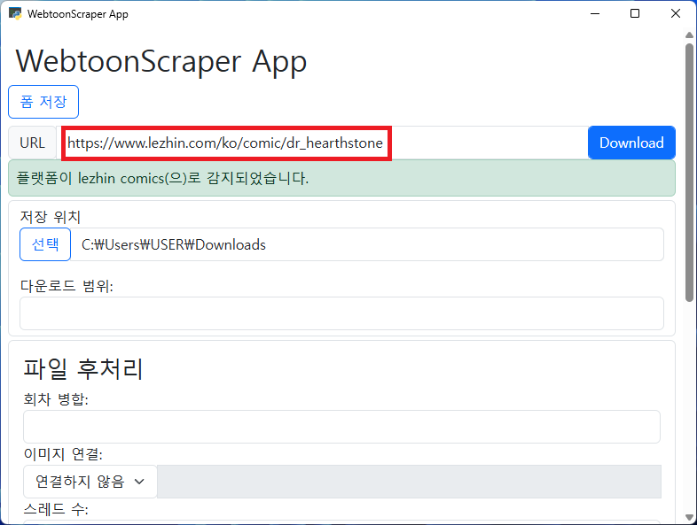
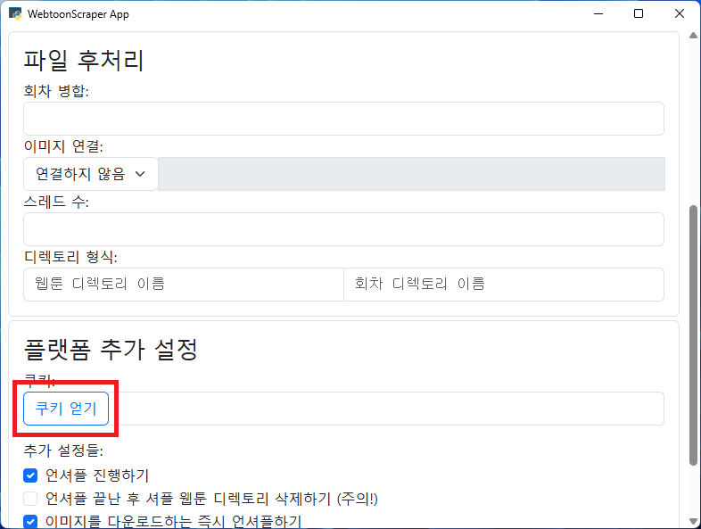
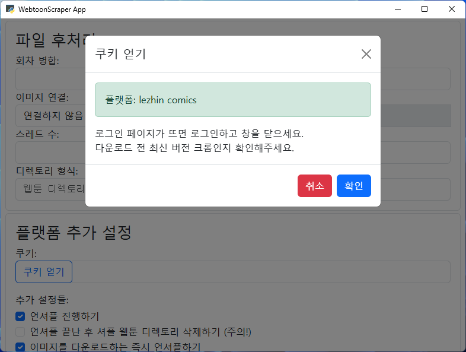
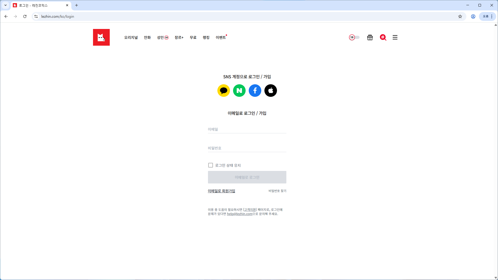
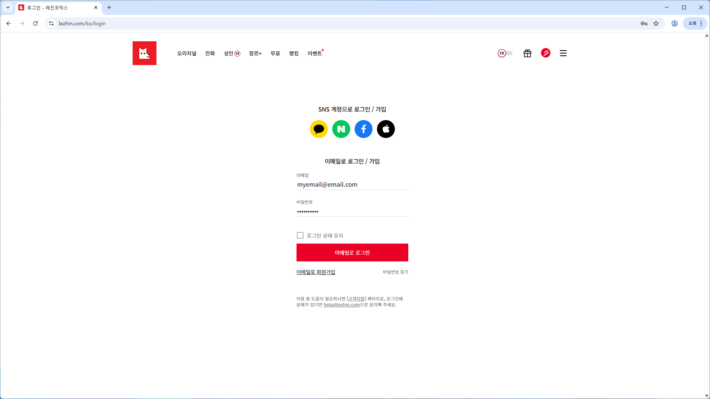
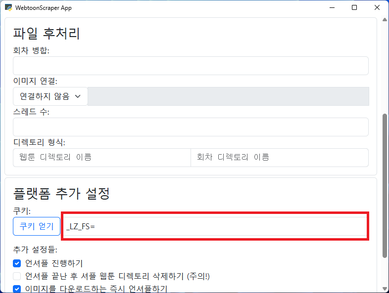
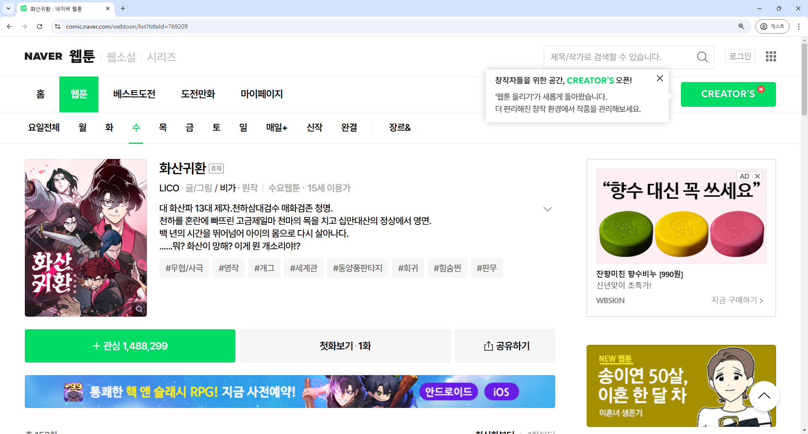
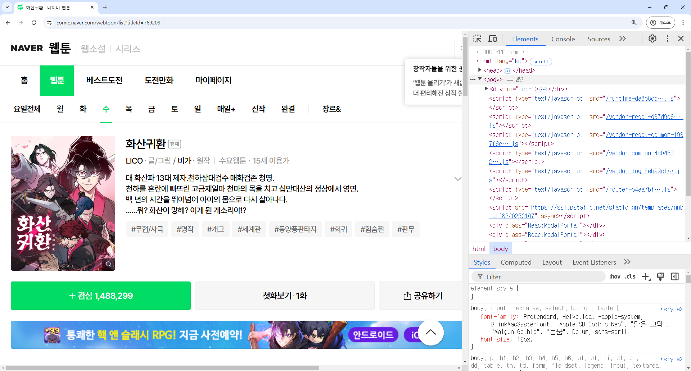
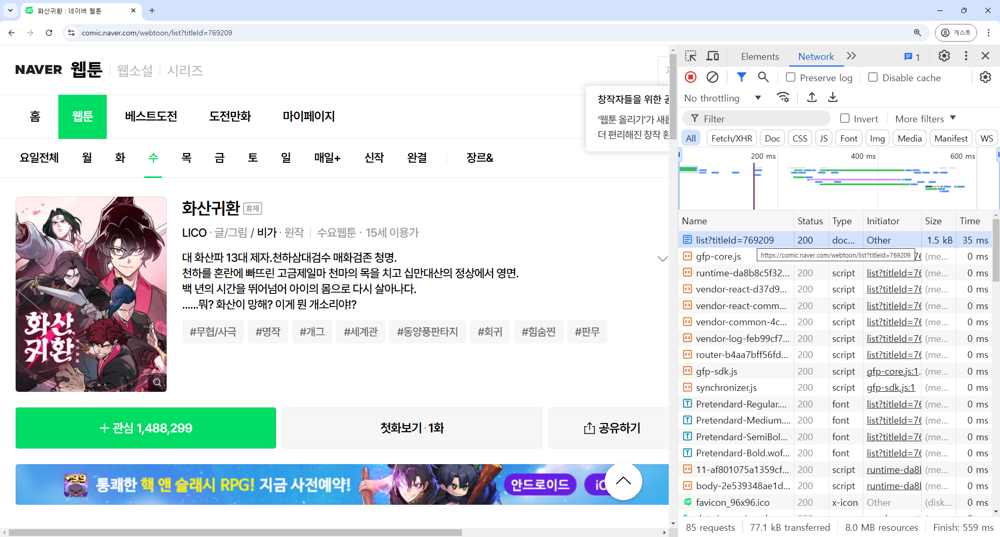
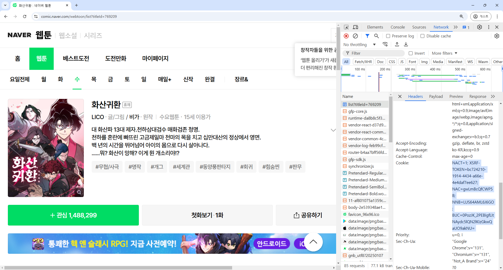

# 쿠키

쿠키는 일종의 웹사이트에서 보여주는 증명서입니다.
이 증명서를 통해 웹사이트는 요청을 보내는 것이 어떤 사용자인지와 같은 정보를 파악할 수 있습니다.
따라서 웹툰을 열람하는 데에 로그인이 필요하다면, 쿠키를 복사해 앱에 붙여넣어 웹툰을 다운로드할 수 있습니다.

모든 플랫폼에서 쿠키가 필요한 것은 아닙니다.
대표적으로 네이버 웹툰의 경우 성인 웹툰이 아니면 다운로드에 쿠키를 필요로 하지 않습니다.

다음은 쿠키가 필요한 플랫폼들만 정리한 표입니다.
여기에 나와 있는 플랫폼들은 특정한 경우에 쿠키를 요구합니다.

| 플랫폼 | 필요 여부 | 비고 |
|--|--|--|
| 네이어 웹툰 | 성인 웹툰의 경우 필요 | |
| 레진코믹스 | 성인 웹툰의 경우 필요 | 특별히 쿠키 외에 bearer가 요구됩니다. [이 내용](platforms.md#레진코믹스-bearer)을 참고하세요 |
| 버프툰 | 필요 | |
| 카카오 웹툰 | 성인 웹툰과 대여 및 구매한 웹툰의 경우 필요 | |
| 투믹스 | 필요 | |
| 탑툰 | 필요 | |

## 쿠키를 안전하게 관리하기

얻은 쿠키 데이터는 사이트에 로그인하기 위한 중요한 정보가 포함되어 있습니다.
이 데이터가 탈취될 경우 자신으로 가장한 악의적인 공격자가 계정을 이용할 수 있으니 반드시 유출되지 않도록 조심해야 합니다.
WebtoonScraper는 쿠키 데이터를 절대 외부로 반출하지 않으며 모든 데이터는 로컬에서 처리됩니다.

## `쿠키 얻기` 버튼

앱에서는 `쿠키 얻기` 버튼을 통해 쿠키를 얻을 수 있습니다.

`쿠키 얻기` 기능을 사용하기 전에 **최신 버전의 크롬**이 설치되어 있어야 합니다.



우선 URL란에 원하는 플랫폼의 링크를 붙여넣으세요.



그런 다음 아래로 가 `쿠키 얻기` 버튼을 누르세요.



확인 창이 나오면 `확인`을 누르세요.



조금 기다리면 해당 플랫폼의 로그인 창이 나올 것입니다.
이 창에서 로그인하세요.



로그인 정보를 입력한 뒤 창을 닫은 뒤 조금 기다리면 쿠키가 자동으로 입력되어 있을 것입니다.



이 방식으로 간편하게 쿠키를 얻을 수 있습니다.

## 쿠키 얻기

쿠키를 얻는 방법은 다음과 같습니다.

예시는 네이버 웹툰으로 진행하나 다른 사이트도 쿠키를 얻는 방법은 동일합니다.

원하는 **웹툰 사이트로 가서 로그인**하세요. 예시 이미지에는 따로 로그인이 되어 있지 않지만 쿠키가 필요한 상황에서는 꼭 로그인해야 합니다.



**`f12`를 누르고** `ctrl+R`을 눌러 **새로고침**하세요.
`f12`를 눌러도 반응이 없거나 해당 키를 사용할 수 없는 경우 우클릭 후 우클릭 메뉴의 맨 아래에 있는 `검사`를 선택하세요. 모든 브라우저에서 사용 가능합니다.



`Network` 혹은 `네트워크` 탭으로 가서 제일 **처음에 있는 요청**을 누르세요.



아래로 스크롤에서 `request header` 혹은 `요청 헤더`를 찾은 뒤 그 아래에 **`Cookie:`라고 되어 있는 부분을 찾아 모두 복사하세요**.
해당 내용을 아래의 '쿠키 입력'을 참고해서 WebtoonScraper에 붙여넣으면 됩니다.



### 앱에서 쿠키 적용하기

앱에서 쿠키는 맨 아래의 [플랫폼 추가 설정]란에서 입력할 수 있습니다.


### CLI에서 쿠키 적용하기

CLI에서는 다운로드 시 `--cookie` [인자](downloading-cli.md#추가-인자-설정)를 통해 쿠키를 입력할 수 있습니다.
쿠키 문자열은 일반적으로 상당히 길기 때문에 압도될 수 있지만, 큰따옴표만 잘 붙이면 문제 없이 다운로드할 수 있습니다.

```console
webtoon download "<url>" --cookie "<cookie>"
```
