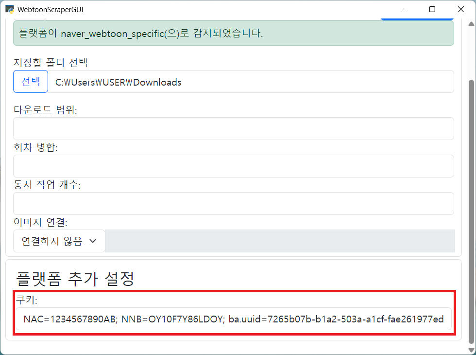

# 쿠키

쿠키는 일종의 웹사이트에서 보여주는 증명서입니다.
이 증명서를 통해 웹사이트는 요청을 보내는 것이 어떤 사용자인지와 같은 정보를 파악할 수 있습니다.
따라서 웹툰을 열람하는 데에 로그인이 필요하다면, 쿠키를 복사해 앱에 붙여넣어 웹툰을 다운로드할 수 있습니다.

모든 플랫폼에서 쿠키가 필요한 것은 아니니 [플랫폼 문서](./platforms.md)를 참고해 쿠키가 필요한지 여부를 확인하세요.

## 쿠키를 안전하게 관리하기

얻은 쿠키 데이터는 사이트에 로그인하기 위한 중요한 정보가 포함되어 있습니다.
이 데이터가 탈취될 경우 자신으로 가장한 악의적인 공격자가 계정을 이용할 수 있으니 반드시 유출되지 않도록 조심해야 합니다.
WebtoonScraper는 쿠키 데이터를 절대 외부로 반출하지 않으며 모든 데이터는 로컬에서 처리됩니다.

## 쿠키 얻기

쿠키는 다양한 방식으로 얻을 수 있습니다. 이 문서에서는 쿠키를 얻고 적용시키는 방법에 대해 다룹니다.

### 확장 프로그램을 통해 쿠키 얻기

쿠키를 얻기 가장 간편한 방법은 [Get cookies.txt LOCALLY](https://chromewebstore.google.com/detail/get-cookiestxt-locally/cclelndahbckbenkjhflpdbgdldlbecc) ([파이어폭스](https://addons.mozilla.org/en-US/firefox/addon/get-cookies-txt-locally/)) 확장 프로그램을 사용하는 것입니다.
이 확장 프로그램을 사용하면 주로 사용하는 브라우저에서 간단하게 쿠키를 얻어 사용할 수 있습니다.

우선 원하는 브라우저에 해당 확장 프로그램을 설치합니다.

**원하는 웹사이트로 이동**한 뒤 확장 프로그램을 클릭해 확장 프로그램 창을 엽니다.


버튼이 좀 많아 햇갈릴 수 있는데요, 여기에서 세 번째 줄에 있는 **`Export Format`** 옆의 드롭다운을 눌러 JSON으로 선택해주세요.

값을 설정한 뒤에 맨 위 오른쪽에 있는 **`Copy`** 버튼을 누르면 쿠키가 클립보드에 복사됩니다.

이 쿠키값을 앱에서 **플랫폼 추가 설정** 섹션의 **쿠키**란에 붙여넣으면 됩니다.

만약 플랫폼 추가 설정이 보이지 않는다면 URL 입력란에 해당 플랫폼의 링크를 입력해주세요.

확장 프로그램을 고정시켜 놓으면 조금 더 간편하게 다음 번에도 쿠키를 사용할 수 있습니다.

### `쿠키 얻기` 버튼

앱에서는 `쿠키 얻기` 버튼을 통해 쿠키를 얻을 수 있습니다.


우선 URL란에 원하는 플랫폼의 링크를 붙여넣으세요.


그런 다음 아래로 가 `쿠키 얻기` 버튼을 누르세요.


확인 창이 나오면 `확인`을 누르세요.


조금 기다리면 해당 플랫폼의 로그인 창이 나올 것입니다.
이 창에서 로그인하세요.


로그인 정보를 입력한 뒤 창을 닫은 뒤 조금 기다리면 쿠키가 자동으로 입력되어 있을 것입니다.


이 방식으로 간편하게 쿠키를 얻을 수 있습니다.

### 브라우저 개발자 도구로 쿠키 얻기

예시는 네이버 웹툰으로 진행하나 다른 사이트도 쿠키를 얻는 방법은 동일합니다.

원하는 **웹툰 사이트로 가서 로그인**하세요. 예시 이미지에는 따로 로그인이 되어 있지 않지만 쿠키가 필요한 상황에서는 꼭 로그인해야 합니다.


**`f12`를 누르고** `ctrl+R`을 눌러 **새로고침**하세요.
`f12`를 눌러도 반응이 없거나 해당 키를 사용할 수 없는 경우 우클릭 후 우클릭 메뉴의 맨 아래에 있는 `검사`를 선택하세요. 모든 브라우저에서 사용 가능합니다.


`Network` 혹은 `네트워크` 탭으로 가서 제일 **처음에 있는 요청**을 누르세요.


아래로 스크롤에서 `request header` 혹은 `요청 헤더`를 찾은 뒤 그 아래에 **`Cookie:`라고 되어 있는 부분을 찾아 모두 복사하세요**.
해당 내용을 아래의 '쿠키 입력'을 참고해서 WebtoonScraper에 붙여넣으면 됩니다.


## 쿠키 적용하기

### 앱에서 쿠키 적용하기

앱에서 쿠키는 맨 아래의 [플랫폼 추가 설정]란에서 입력할 수 있습니다.



### CLI에서 쿠키 적용하기

CLI에서는 다운로드 시 `--cookie` [인자](downloading-cli.md#추가-인자-설정)를 통해 쿠키를 입력할 수 있습니다.
쿠키 문자열은 일반적으로 상당히 길기 때문에 압도될 수 있지만, 큰따옴표만 잘 붙이면 문제 없이 다운로드할 수 있습니다.

```console
webtoon download "<url>" --cookie "<cookie>"
```
