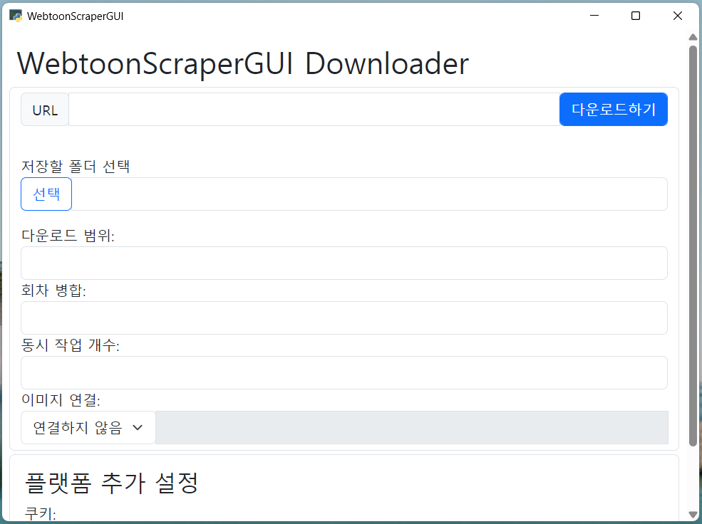

# WebtoonScraper

**[English documentation is available](./README-en.md).**

다양한 웹사이트에서 웹툰을 쉽고 빠르게 다운로드받으세요

WebtoonScraper(웹툰 스크래퍼) 앱을 통하면 다양한 다양한 웹사이트에서 웹툰을 쉽고 빠르게 다운로드받으실 수 있습니다.
윈도우와 맥OS에서 앱을 지원하며 리눅스에서는 CLI 환경을 제공합니다.

WebtoonScraper를 통해 **네이버 웹툰, 레진코믹스, 카카오 웹툰, 카카오페이지, webtoons.com, 리디북스 웹툰, 탑툰, 봄툰, 투믹스, 버프툰, 이만배, 투비컨티뉴드, 재담쇼츠, 네이버 게임 오리지널, 네이버 블로그, 티스토리**에서 웹툰을 다운로드할 수 있으며, 그 외 이미지 연결이나 회차 폴더 병합 등의 부가기능을 사용할 수 있습니다.

## 이용 방법

[Patreon](https://www.patreon.com/ilotoki0804)으로 후원하시면 개발자를 후원하실 수 있으며 다음과 같은 다양한 기능을 사용할 수 있습니다.
일회성으로 구매할 수도 있고, 월 단위로 모든 릴리즈를 자유롭게 사용할 수 있는 멤버쉽도 사용 가능합니다.

* WebtoonScraper 앱과 CLI 다운로드
* 다양한 플랫폼에서의 웹툰 다운로드 지원
* 에피소드 디렉토리 병합 및 이미지 연결 기능
* 컴퓨터에서의 자체 웹툰 뷰어 웹툰 파일에 내장 (webtoon.html)

## 더 알아보기

더 다양한 문서들을 통해 WebtoonScraper에 대해 이해하실 수 있습니다.

WebtoonScraper의 기본적인 [설치](./installing.md)와 [다운로드](./downloading-app.md)는 각각의 문서를 참고하세요.

WebtoonScraper의 [범위 설정](./download-range.md)과 [쿠키 얻기](./cookie.md), [회차 폴더 이름 설정](./directory-name.md)에 대해서도 알아보세요.

WebtoonScraper의 부가기능인 [이미지 연결](./concatenating.md), [폴더 병합](./merging.md)도 참고하세요.

WebtoonScraper의 각 플렛폼별 지원 현황과 사용 방법이 궁금하다면 [플랫폼](./platforms.md) 문서를 참고하세요.

WebtoonScraper의 CLI(명령줄 인터페이스) 환경에 대해 궁금하다면 [CLI에서 다운로드하기](./downloading-cli.md) 문서를 참고하세요.

마지막으로 [저장한 웹툰을 열람](./how-to-view.md)하는 방법에 대해서도 알아보세요.

책임 있는 WebtoonScraper의 사용에 대해 알고 싶다면 [이 문서](./copyright.md)를 참고해 주세요.

## PyPI 및 Github 버전

WebtoonScraper의 핵심 로직과 일부 스크래퍼는 [PyPI (WebtoonScraper)](https://pypi.org/project/WebtoonScraper/)와 [Github](https://github.com/ilotoki0804/WebtoonScraper)에 공개되어 있습니다.

PyPI 및 Github에 공개된 기술적인 측면이 궁금하다면 [이 문서](./inside-scraper.md)를 참고하세요.

## 릴리즈 노트

[릴리즈 노트 문서](./releases.md)를 참고하세요.

## 이용 방법

WebtoonScraper는 크게 세 가지 종류로 나뉘어집니다.

* 앱
* CLI 버전
* PyPI 패키지

**앱**는 [후원](https://www.patreon.com/ilotoki0804)을 하면 이용할 수 있고 *네이버 웹툰과 레진코믹스, 카카오 웹툰, 카카오페이지, webtoons.com, 리디북스 웹툰, 탑툰, 봄툰, 투믹스, 버프툰, 이만배, 투비컨티뉴드, 재담쇼츠, 네이버 게임 오리지널, 네이버 블로그, 티스토리*에서도 웹툰 다운로드를 지원하며, 특별한 설치 없이도 사용 가능합니다. 윈도우와 맥을 지원합니다.

**CLI**는 앱과 마찬가지로 [후원](https://www.patreon.com/ilotoki0804)하면 이용할 수 있으며 직접 명령어를 입력해 사용할 수 있습니다. 윈도우, 맥, 리눅스를 지원합니다.

**PyPI 패키지**는 가장 기본이 되는 버전이며 자유롭게 다운로드해 사용할 수 있지만 파이썬을 설치해야 하고 *네이버 웹툰만 지원*합니다.

## 오류를 발견했어요!

모든 프로그램이 그렇듯 WebtoonScraper를 사용하다 보면 오류를 발견할 수도 있습니다.
그럴 경우 [깃허브 이슈](https://github.com/ilotoki0804/WebtoonScraper/issues/)를 만들거나 [패트리온 DM](https://www.patreon.com/ilotoki0804)으로 연락 주시면 됩니다. 보통은 하루 이내에 답장을 받으실 수 있을 겁니다.

오류를 설명할 때는 다음과 같은 사항들을 알려주시면 더 빠르게 수정될 수 있습니다.

* `webtoon --version`을 실행했을 때 출력되는 문자열. 최신이 아닐 경우 제보 전 최신 버전으로 업데이트한 후 해결되는지 확인하세요!
* 사용한 프로그램 (앱, CLI, PyPI 패키지)
* 다운로드하려고 시도했던 웹툰의 URL
* 운영체제 (윈도우/맥/리눅스)
* (CLI/PyPI의 경우)`-v` 플래그 추가해 다운로드 시도한 뒤 출력되는 문자열(예: `webtoon -v download "<url>"`)
