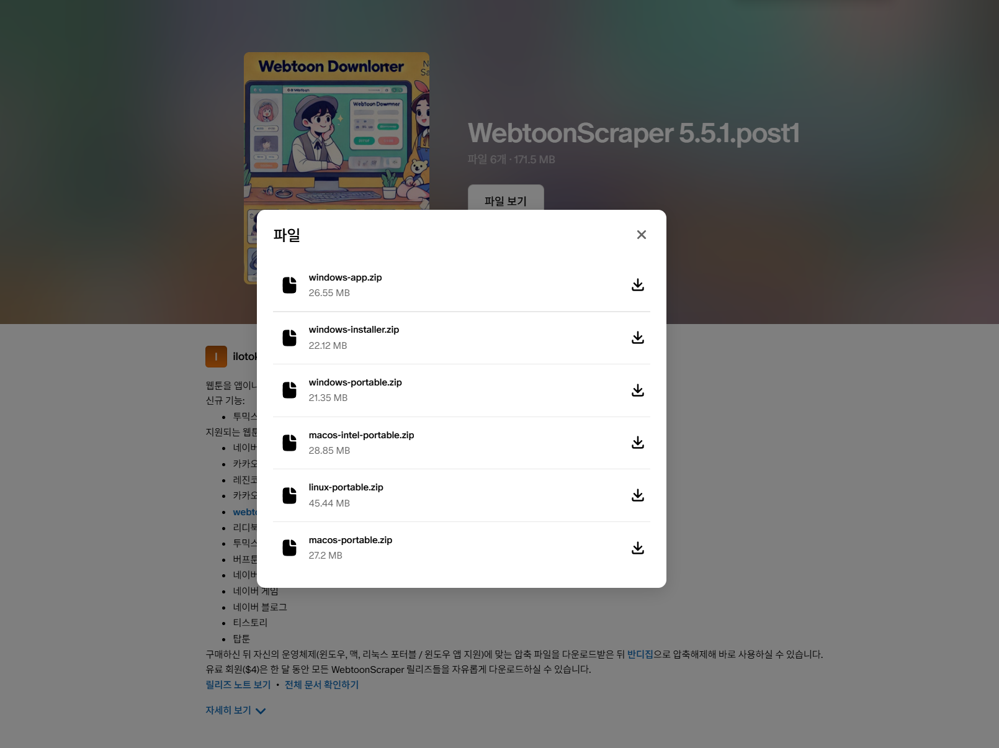

# 설치

## PyPI 패키지

파이썬을 설치한 후 다음의 명령어를 작성하세요.

```console
pip install WebtoonScraper
```

이러면 설치가 끝납니다. 설치가 제대로 되었는지 확인하려면 다음의 명령어로 확인해 보세요.

```console
webtoon --version
```

## 포터블 및 앱

### 후원

[패트리온](https://www.patreon.com/ilotoki0804)에서 후원할 경우 포터블과 앱을 다운로드받으실 수 있습니다.

멤버십은 멤버십을 유지하는 동안 새 버전이 나왔을 때 바로 다운로드받을 수 있고,
포스트 구매는 일회성이지만 멤버십과 마찬가지로 요구시 일정 기간 지원을 받을 수 있습니다.

### 다운로드 및 열기

멤버십이거나 상품을 구매하면 앱과 실행 파일을 다운로드하실 수 있을 겁니다.

이때 원하는 프로그램과 운영 체제를 선택하면 됩니다. 앱을 원한다면 `app`으로 끝나는 압축 파일을, 포터블을 다운로드하고 싶은 경우 `portable`로 끝나는 압축 파일을 다운로드하면 됩니다. 윈도우로 표기되어있는 프로그램은 **윈도우 10과 11에서 모두 작동**합니다.

**앱**의 경우 아직까지는 윈도우에서만 사용 가능합니다. **포터블**은 윈도우, 맥(ARM/인텔맥 모두), 리눅스 모두에서 사용 가능합니다.



이제 압축 파일을 풀면 되나, 윈도우의 경우 기본 압축 해제 프로그램을 이용하면 제대로 파일이 해제되지 않는 문제가 발생할 수 있으니 **압축 해제에는 [반디집(무료)](https://www.bandisoft.com/bandizip)를 사용하는 것을 권장**합니다.

압축 파일을 풀면 `_internal` 폴더와 하나의 실행 파일(아래 예시의 경우 `WebtoonScraperGUI.exe`)가 보일 텐데 `_internal` 폴더는 작동하는 데에 필요하지만 딱히 직접 건드릴 일은 없습니다. 중요한 것은 해당 실행 파일로, 해당 실행 파일을 열어주세요.

윈도우의 경우 "Windows의 PC 보호" 창이 나타난다면 이때 "추가 정보"를 누르고 아래의 "실행" 버튼을 눌러주세요.
리눅스의 경우 `bash: ./portable: Permission denied`라고 나오며 실행이 되지 않는다면 `chmod +x ./portable`을 먼저 실행해 주세요.


아래와 같이 앱이나 터미널이 뜨면 성공입니다! 이제 사용하실 수 있습니다.


### 앱 설치하기

WebtoonScraper 앱의 경우 별도로 설치하여 사용할 수도 있습니다.
`window-installer.zip` 파일을 다운로드받아 압축을 풀면 `windows-installer.exe`라는 파일이 나타납니다.

해당 파일을 클릭하면 설치 설정이 시작됩니다.

만약 "Windows의 PC 보호" 창이 나타난다면 이때 "추가 정보"를 누르고 아래의 "실행" 버튼을 눌러주세요.

첫 설정은 WebtoonScraper 앱을 설치할 범위를 정합니다. `Install for all users`를 선택하면 앱이 컴퓨터 내의 모든 사용자에게 설치되고, `Install for me only`를 선택하면 현재 사용자에게만 설치됩니다. 둘 모두 사용성에는 큰 차이가 없으니 원하는 대로 선택하시면 됩니다.


다음은 설치 위치를 정합니다. 기본적으로 설정되어 있으니 별도로 변경할 필요는 없습니다.


다음은 바탕화면에 WebtoonScraper로의 바로가기를 만들 것인지를 확인합니다. 기본적으로는 만들지 않도록 설정되어 있고, 체크박스를 선택하면 설치 후 바탕화면에 바로가기가 생성됩니다.


조금 기다리면 설치가 완료됩니다. 완료 후에는 `Finish` 버튼을 눌러 설치를 완료할 수 있고, 선택적으로 `Launch WebtoonScraper` 버튼을 눌러 WebtoonScraper를 열 수 있습니다.


#### 설치된 앱 업데이트

이미 WebtoonScraper를 설치한 상태에서 새로운 버전의 WebtoonScraper를 사용하고 싶다면 설치했을 때와 동일하게 `windows-installer.exe`을 실행시키면 됩니다.

설치 위치나 방식 등은 자동으로 이전에 설치된 방법을 따르기 때문에 별도의 설정이 필요하지 않아 설치 시보다 간단하게 업데이트할 수 있습니다.

### 직접 사용하기

`./portable` 혹은 `portable.exe`에 어떠한 인자도 설정하지 않은 채 실행하면(기본) CLI 셸이 실행됩니다.
인자와 함께 실행할 경우 `webtoon` 명령어를 사용하는 것과 같은 방식으로 실행해 사용할 수 있습니다.

예를 들어 아래의 명령어는 CLI 셸과 동일하게 `<URL>`에 해당하는 웹툰을 다운로드합니다.

```console
# 윈도우에서
portable download "<url>"

# 맥과 리눅스에서
./portable download "<URL>"
```
