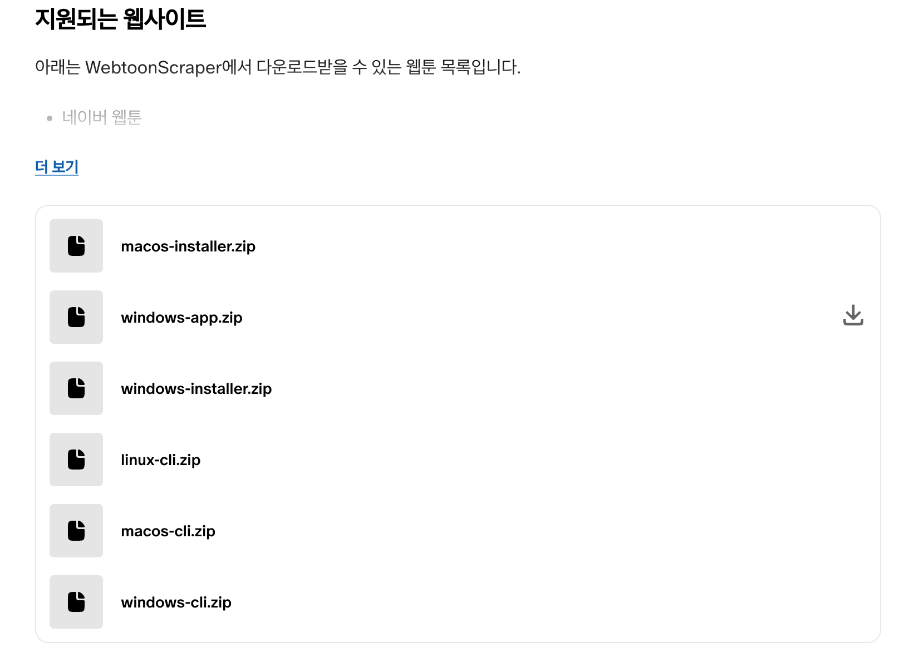
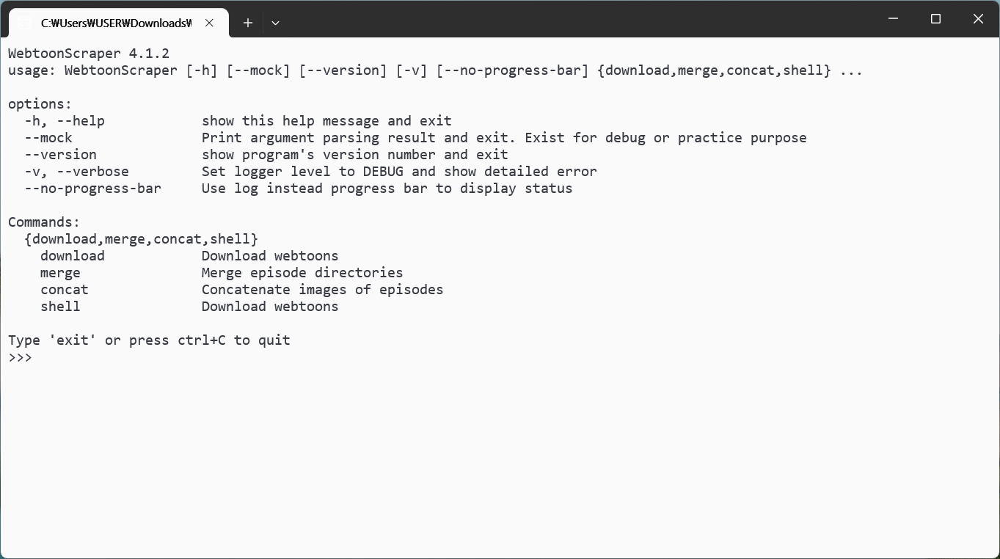

# 설치

## PyPI 패키지

파이썬을 설치한 후 다음의 명령어를 작성하세요.

```console
pip install WebtoonScraper
```

이러면 설치가 끝납니다. 설치가 제대로 되었는지 확인하려면 다음의 명령어로 확인해 보세요.

```console
webtoon --version
```

PyPI 패키지 버전은 네이버 웹툰과 레진코믹스 다운로드를 지원합니다. 그 외 플랫폼들(카카오 웹툰, 카카오페이지, webtoons.com, 리디북스 웹툰, 탑툰, 봄툰, 투믹스, 버프툰, 이만배, 투비컨티뉴드, 재담쇼츠, 네이버 게임 오리지널, 네이버 블로그, 티스토리)에서 웹툰을 다운로드받거나 고급 기능(이미지 연결, 회차 병합 등)을 사용하려면 CLI 혹은 앱을 사용해야 합니다.

## 앱 및 CLI

### 후원

[패트리온](https://www.patreon.com/ilotoki0804)에서 후원할 경우 CLI과 앱을 다운로드받으실 수 있습니다.

멤버십은 멤버십을 유지하는 동안 새 버전이 나왔을 때 바로 다운로드받을 수 있고,
포스트 구매는 일회성이지만 멤버십과 마찬가지로 요구시 일정 기간 지원을 받을 수 있습니다.

### 다운로드 및 열기

멤버십에 가입하시거나 포스트를 구매하시면 아래와 같이 파일이 보이고 모든 파일을 다운로드할 수 있게 됩니다.



운영체제와 사용 목적에 따라 적절한 파일을 선택해 다운로드받으실 수 있습니다.

`windows-app`, `windows-installer`, `macos-installer` 모두 WebtoonScraper의 앱을 설치할 때 다운로드받아 사용합니다.

* `windows-installer`는 윈도우에서 사용할 수 있는 인스톨러가 들어 있으며, WebtoonScraper를 컴퓨터에 설치해 앱으로 사용할 수 있습니다.
* `windows-app`은 윈도우에서 설치 없이 바로 실행해서 사용할 수 있는 포터블 형식의 프로그램입니다.
* `macos-installer`는 `.dmg` 파일이 들어 있으며, 원하는 방식에 따라 설치해 사용하거나 바로 열어 사용할 수 있습니다.

`windows-cli`, `macos-cli`, `linux-cli`의 경우 각 운영체제에 대해 명령어를 직접 작성하며 사용하는 CLI 환경을 사용할 수 있습니다.

더욱 상세한 설치 과정에 대한 설명은 아래의 내용을 참고하세요.
윈도우로 표기되어있는 프로그램은 **윈도우 10과 11에서 모두 작동**합니다.

### 압축 해제하기

앱을 실행하기 위해선 반드시 압축 파일을 해제해야 합니다.

이때, 윈도우의 경우 기본 압축 해제 프로그램을 이용하면 제대로 파일이 해제되지 않는 문제가 발생할 수 있으니 **압축 해제에는 [반디집(무료)](https://www.bandisoft.com/bandizip)를 사용하는 것을 권장**합니다.

맥에서는 특별한 문제가 발생하지 않으니 그냥 클릭해서 압축해제해도 무방합니다.

### 윈도우에서 앱 설치하기

WebtoonScraper 앱의 경우 별도로 설치하여 사용할 수도 있습니다.
`window-installer.zip` 파일을 다운로드받아 압축을 풀면 `windows-installer.exe`라는 파일이 나타납니다.

해당 파일을 클릭하면 설치 설정이 시작됩니다.

만약 "Windows의 PC 보호" 창이 나타난다면 이때 "추가 정보"를 누르고 아래의 "실행" 버튼을 눌러주세요.

첫 설정은 WebtoonScraper 앱을 설치할 범위를 정합니다. `Install for all users`를 선택하면 앱이 컴퓨터 내의 모든 사용자에게 설치되고, `Install for me only`를 선택하면 현재 사용자에게만 설치됩니다. 둘 모두 사용성에는 큰 차이가 없으니 원하는 대로 선택하시면 됩니다.


다음은 설치 위치를 정합니다. 기본적으로 설정되어 있으니 별도로 변경할 필요는 없습니다.


다음은 바탕화면에 WebtoonScraper로의 바로가기를 만들 것인지를 확인합니다. 기본적으로는 만들지 않도록 설정되어 있고, 체크박스를 선택하면 설치 후 바탕화면에 바로가기가 생성됩니다.


조금 기다리면 설치가 완료됩니다. 완료 후에는 `Finish` 버튼을 눌러 설치를 완료할 수 있고, 선택적으로 `Launch WebtoonScraper` 버튼을 눌러 WebtoonScraper를 열 수 있습니다.


#### 설치된 앱 업데이트

이미 WebtoonScraper를 설치한 상태에서 새로운 버전의 WebtoonScraper를 사용하고 싶다면 설치했을 때와 동일하게 `windows-installer.exe`을 실행시키면 됩니다.

설치 위치나 방식 등은 자동으로 이전에 설치된 방법을 따르기 때문에 별도의 설정이 필요하지 않아 설치 시보다 간단하게 업데이트할 수 있습니다.

### 윈도우에서 포터블 앱 혹은 CLI 사용하기

압축 파일을 풀면 `_internal` 폴더와 하나의 실행 파일(아래 예시의 경우 `WebtoonScraperGUI.exe`)이 존재할 것입니다.
`_internal`은 프로그램이 작동하는 데에 필요한 파일들이 들어있으며 삭제하거나 수정할 경우 프로그램에 오류가 발생할 수 있습니다.
중요한 것은 해당 실행 파일로, 해당 실행 파일을 열어주세요.

윈도우의 경우 "Windows의 PC 보호" 창이 나타난다면 이때 "추가 정보"를 누르고 아래의 "실행" 버튼을 눌러주세요.


아래와 같이 앱이나 터미널이 뜨면 성공입니다! 이제 사용하실 수 있습니다.




### 맥에서 앱 설치 및 사용하기

`macos-installer.zip`파일을 파인더에서 더블클릭하면 `WebtoonScraperApp.dmg` 파일이 압축 해제됩니다.
`WebtoonScraperApp.dmg`를 다시 더블클릭하면 `WebtoonScraperApp`과 `Applications` 폴더가 나타납니다.
다음과 같은 방법을 통해 앱을 활용할 수 있습니다.
`WebtoonScraperApp`을 `Applications`로 드래그하거나, 원하는 다른 파인더 혹은 바탕화면의 위치로 드래그해서 포터블로 사용하거나, 바로 클릭해서 실행할 수도 있습니다.

`'WebtoonScraperApp'을 열지 않음` 오류가 발생한다면 `개인정보 보호 및 보안 > 보안 > 그래도 허용`을 누르세요.

만약 `Applications`로 그래그했다면 앱이 설치된 것입니다. 스포트라이트나 런치패드를 통해 앱을 실행하고 사용하면 됩니다.
원하는 다른 위치로 그래그했거나 바로 `.dmg` 파일에 있는 상태로 앱을 테스트해볼 수도 있습니다. 이때도 더블클릭해 바로 사용하실 수 있습니다.

### 맥에서 CLI 사용하기

`macos-cli.zip` 파일을 파인더에서 더블클릭하면 `macos-cli` 폴더가 생성됩니다. 클릭한 뒤

`'main'을 열지 않음` 오류가 발생한다면 `개인정보 보호 및 보안 > 보안 > 그래도 허용`을 누르세요.
뒤이어 비슷한 오류가 발생하면 같은 과정을 반복하세요.

설치가 완료되면 `./main` 을 통해 셸에 접근하거나 인자를 주어 직접 사용할 수 있습니다.

### 리눅스에서 CLI 사용하기

리눅스를 사용하실 정도라면 제 도움이 그리 필요하진 않으시겠지만 그래도 굳이 사용하는 방법을 설명해드리겠습니다.

파일을 다운로드 받으신 후 다음의 명령어로 압축을 해제하세요.

```console
unzip "linux-cli.zip" -d wt
```

그런 다음 이동해서 사용하시면 됩니다.

```console
cd wt
./main
```

만약 실행 권한이 없어 `bash: ./main: Permission denied`라는 오류가 발생한다면 실행 권한을 부여해 주세요.

```console
chmod +x ./main
./main
```

cli를 사용할 때는 `./main`으로 실행해 셸을 통해 앱을 다운로드하실 수도 있지만, 아래의 `직접 사용하기`에서 나오듯, 인자를 주어 바로 WebtoonScraper를 사용하실 수도 있습니다. 자유롭게 활용해 주세요.

### 직접 사용하기

`./main` 혹은 `main.exe`에 어떠한 인자도 설정하지 않은 채 실행하면 CLI 셸 혹은 앱이 실행됩니다.
인자와 함께 실행할 경우 셸을 통하지 않고 직접 사용할 수 있습니다.

예를 들어 아래의 명령어는 CLI 셸과 동일하게 `<URL>`에 해당하는 웹툰을 다운로드합니다.

```console
# 윈도우에서
main download "<URL>"

# 맥과 리눅스에서
./main download "<URL>"
```
